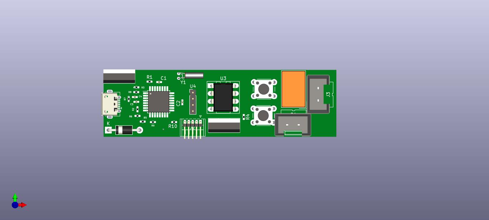
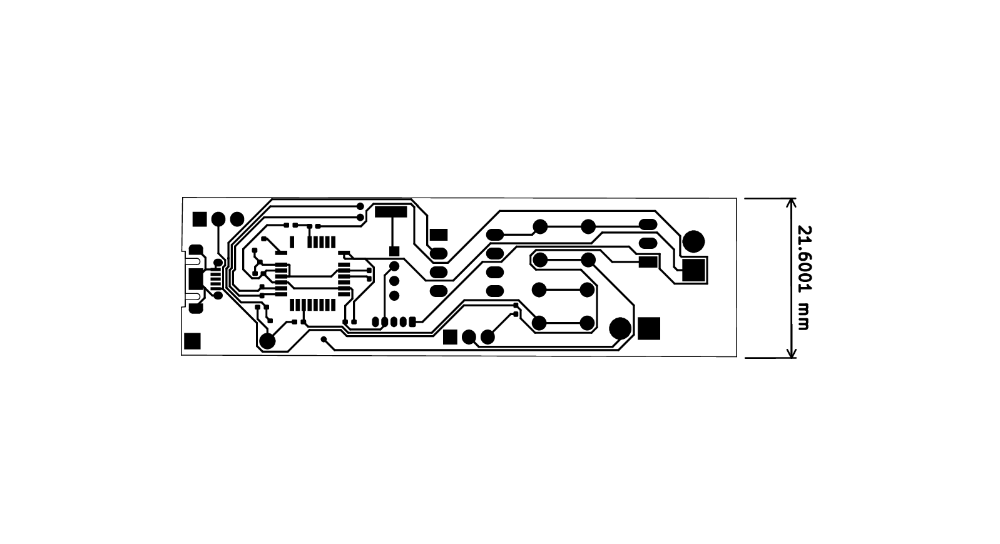
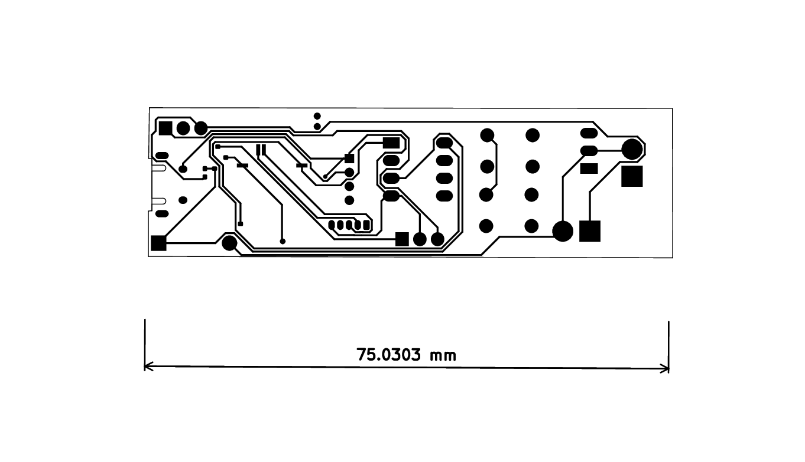

## Soldering Iron

> With special features

1.  OLED temperature display
2.  Increment push button
3.  Decrement push button
4.  USB port for programming
5.  90 degree orientation input-output plug

[click here](./soldering_iron.pdf) to see the Schematic diagram

**The Upper layer of PCB**

**The Lower layer of PCB**

The 3D view of this soldering iron's pcb is here :

[3D view](https://grabcad.com/library/soldering-iron-22)

> Don't forget to spread the 💝 by giving this repo 🌟

**Thank you**

Credit : **[AMIT BARMAN](https://abhisandhi.netlify.app/)** 
        ETC undergrad at **IIESTS**'25
